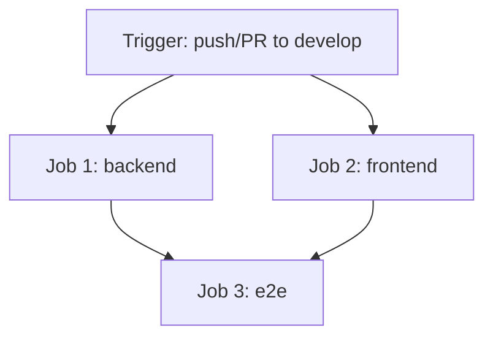

# IT Service Platform

Fullstack IT Service Management Platform with Express (Node.js/Prisma/PostgreSQL) backend, Next.js (App Router/MUI) frontend, Vitest backend tests, and Playwright E2E tests.

---

## Continuous Integration (CI) Pipeline

This repository includes an automated GitHub Actions CI workflow configured in [`.github/workflows/ci.yml`](./.github/workflows/ci.yml).

### Pipeline Overview

The CI pipeline runs automatically on:
- Every `push` to the `develop` branch
- Every `pull_request` targeting the `develop` branch

### Workflow Jobs



1. **`backend` Job**
   - **Service Container**: PostgreSQL 16 (`postgres:16-alpine`)
   - **Environment Setup**: Node.js 20 with `npm` caching
   - **Steps**:
     - `npm ci` — Install exact backend dependencies
     - `npm run lint` — ESLint code quality & zero-warning policy
     - `npm run prisma:generate` — Generate Prisma Client
     - `npx prisma migrate deploy` — Apply database migrations to CI test database
     - `npm test` — Run Vitest backend automated test suite
     - `npm run build` — Compile TypeScript (`tsc`)

2. **`frontend` Job**
   - **Environment Setup**: Node.js 20 with `npm` caching
   - **Steps**:
     - `npm ci` — Install exact frontend dependencies
     - `npm run lint` — ESLint code quality check
     - `npm run build` — Next.js production build (`next build`)

3. **`e2e` Job** (Depends on `backend` & `frontend`)
   - **Service Container**: PostgreSQL 16
   - **Steps**:
     - Prepares test database with Prisma migrations and initial seed data (`npm run seed`)
     - Starts backend API server on `http://localhost:4000` and waits for `/api/health`
     - Installs Playwright Chromium browser binary
     - Runs Playwright E2E test suite (`auth.spec.ts`, `tickets.spec.ts`, `rbac.spec.ts`)
     - Uploads Playwright HTML report, screenshots, and trace artifacts on test failure

---

## Local Verification Commands

Run the following commands locally to mirror the CI pipeline checks:

### Backend
```bash
cd backend
npm ci
npm run lint
npm test
npm run build
```

### Frontend
```bash
cd frontend
npm ci
npm run lint
npm run build
```

### End-to-End (E2E)
```bash
# Requires backend running on localhost:4000
cd frontend
npx playwright test
```
